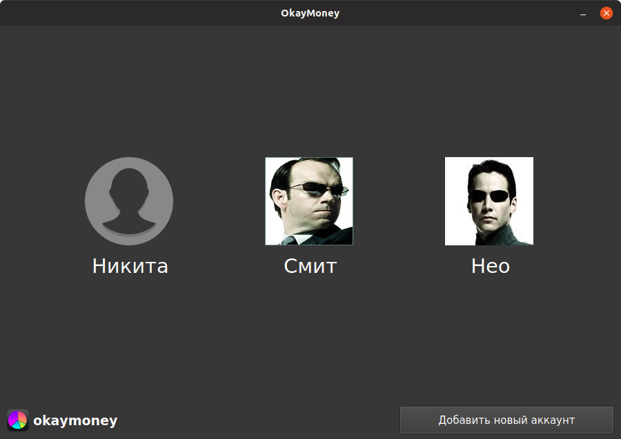
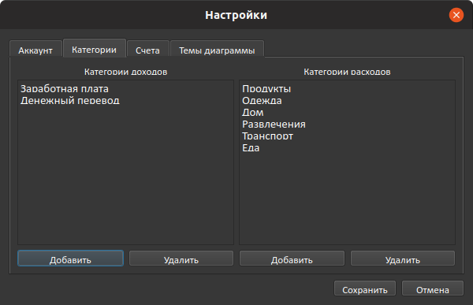
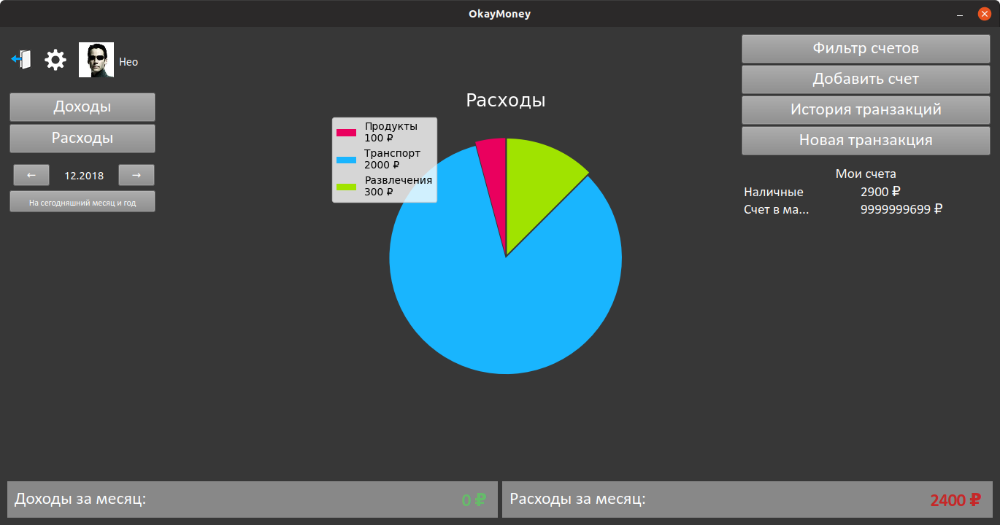
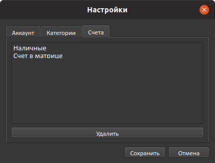
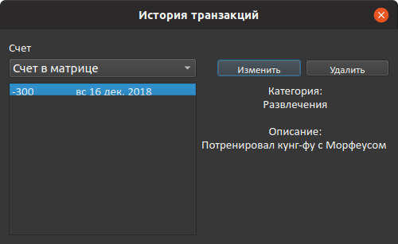

# OkayMoney

Наш проект - приложение для контроля доходов и расходов.  

## Возможности
- Добавление нескольких пользователей. Пользователь может выбрать себе аватарку.

- Доходы и расходы разделены по категориям.

- Круговая диаграмма, показывающая сумму доходов и расходов разных категорий. 
  Позволяет быстро узнать, куда деваются деньги.

- Несколько счетов с отдельными значениями суммы: наличные, деньги на карте, т. д.

- Возможность добавления заметок к транзакциям.

- Просмотр транзакций за прошлые месяцы.

## Использованные библиотеки
- **PyQt5**
- **Matplotlib** - для создания круговой диаграммы
- **Pillow** - работа с аватаркой
