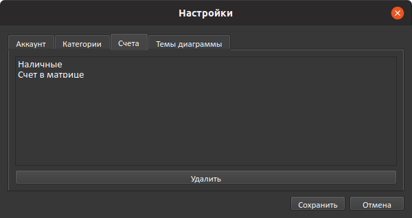
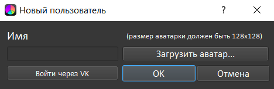

# OkayMoney

OkayMoney - приложение для контроля доходов и расходов.

В современном обществе люди часто сталкиваются с проблемой контроля собственных финансов. Приложение, позволяющее следить за расходами и доходами, значительно упрощает эту задачу.

## Авторы
- [Protocs (Уткин Никита)](https://github.com/Protocs)
- [makeitokay (Васильев Андрей)](https://github.com/makeitokay)
- [nikitakosatka (Усатов Никита)](https://github.com/nikitakosatka)

## Основные классы
### Логика
```
Account 
Transaction 
User
```

### Окна
```
LoginWindow 
MainWindow 
```
### Диалоги
```
AccountsFilterDialog 
TransactionChangeDialog 
ConfirmActionDialog 
MoreUsersDialog 
NewAccountDialog 
NewCategoryDialog 
SettingsDialog 
TransactionDialog
TransactionsHistoryDialog 
UserRegistrationDialog
SignInDialog
```

### Виджеты
```
GreetingWidget 
PieChart 
UserLoginButton
```

## Использованные библиотеки
- **PyQt5**
- **Matplotlib** - для создания круговой диаграммы
- **Pillow** - работа с аватаркой
- **Requests** – отправка запросов на сервер при синхронизации аккаунта
- **Pickle** – хранение аккаунтов
- **Base64** – передача объектов пользователя серверу


## Возможности
- Добавление нескольких пользователей. Пользователь может выбрать себе аватарку.  

- Доходы и расходы разделены по категориям.  

- Круговая диаграмма, показывающая сумму доходов и расходов разных категорий.   
  Позволяет быстро узнать, куда деваются деньги.  

- Несколько счетов с отдельными значениями суммы: наличные, деньги на карте, т. д.  

- Возможность добавления заметок к транзакциям.  

- Просмотр транзакций за прошлые месяцы.  

- Выбор тем диаграммы.  

- Авторизация через ВКонтакте и синхронизация с сервером


Более подробную информацию о проекте можно прочитать в demo/OkayMoney.docx
